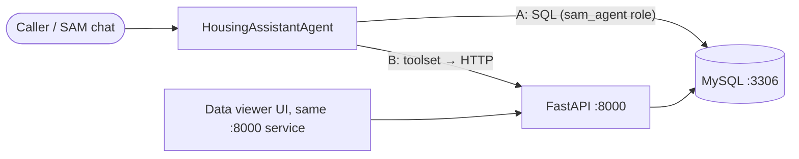

# SAM Housing Service

Mock housing CRM backend for the **SAM (Solace Agent Mesh)** PoC. It demonstrates how a SAM agent
manages housing-related customer queries covering six case categories:

1. Payment ledger update (read/write)
2. TDS record management (read)
3. Document status enquiry (read)
4. Sale deed delay complaint (read/write)
5. Handover process inquiry (read)
6. Registry scheduling (write)

The agent can be wired to the backend **two ways**. Both hit the same data:

| Option | SAM component | Talks to |
|---|---|---|
| **A. Direct database** | MySQL connector | MySQL views + stored procedures |
| **B. REST API** | Python toolset (`sam/toolset`) | FastAPI service → MySQL |



---

## Quick start

Needs Docker only.

```bash
docker compose up -d --build --wait
```

### What runs where

| Container | Port (host) | What it is | Credentials |
|---|---|---|---|
| `sam-housing-api` | **8000** | FastAPI backend **and** the data-viewer UI | none |
| `sam-housing-db` | **3306** | MySQL 8, database `housing` | owner `housing` / `housing123`, agent `sam_agent` / `sam_agent123` |

| Open this | For |
|---|---|
| http://127.0.0.1:8000 | Data viewer UI: browse, add and delete test records |
| http://127.0.0.1:8000/docs | Swagger UI: try every API endpoint in the browser |
| http://127.0.0.1:8000/openapi.json | OpenAPI spec (for an OpenAPI connector) |
| `127.0.0.1:3306` | MySQL, for SAM's MySQL connector or any SQL client |

> **Use `127.0.0.1`, not `localhost`, on Windows.** `localhost` tries IPv6 first, and Docker Desktop
> stalls about 20 seconds on it before falling back. That's slow enough to make SAM tool calls time out.

Ports can be changed with `MYSQL_PORT=3307 API_PORT=8001 docker compose up -d`. Stop everything with
`docker compose down`.

Run the smoke test:

```bash
python tests/smoke_test.py
```

Reset all data back to the seed:

```bash
docker compose down -v
```

---

## Data model

| Table | Contents |
|---|---|
| `projects` | 3 real-estate projects with RERA numbers |
| `units` | 12 flats/plots/villas across the projects |
| `customers` | 8 customers with phone, email, PAN |
| `bookings` | 10 bookings linking customers to units |
| `payments` | ~28 payment records with TDS deductions |
| `documents` | AFS, Sale Deed, Form 132, allotment letters |
| `tds_records` | TDS submissions by financial year |
| `cases` | 8 cases matching the 7 case types |
| `case_comments` | Comment timeline for each case |
| `api_request_log` | Every agent API call (shown in the call log) |

The agent never sees the base tables. It only gets these views:

| View | Use for |
|---|---|
| `customer_bookings` | Customer + unit + project summary |
| `booking_payments` | Payment history for a booking |
| `booking_documents` | Document status (AFS, Sale Deed, etc.) |
| `booking_tds` | TDS submissions by financial year |
| `customer_cases` | Cases / complaints |

And two stored procedures:

```sql
CALL get_payment_summary('+919876543201', 'BK-2023-001');
-- → success, agreement_value, total_paid, total_tds, balance_due

CALL raise_case('+919876543201', 'BK-2023-001', 'PAYMENT_UPDATE', 'Update my ledger', 'Details...');
-- → success, case_ref, message
```

### Demo customers (fictional test data)

| Name | Phone | Bookings | Key case scenarios |
|---|---|---|---|
| Rajesh Kumar Sharma | +919876543201 | B-2/202, B-2/203 (Gharaunda) | Sale deed delay, AFS request |
| Priya Verma | +919876543202 | R-109 plot (Gharaunda) | Payment update (no TDS, under 50L) |
| Amit Gupta | +919876543203 | A-1/501 (Gharaunda) | Document request |
| Sunita Devi | +919876543204 | T05-2501 (Hero Homes) | Form 132, TDS update, handover |
| Vikram Singh Rathore | +919876543205 | T03-1201 (Hero Homes) | — |
| Neha Agarwal | +919876543206 | GV-A/301 (Green Valley) | — |
| Manoj Kumar Yadav | +919876543207 | R-215 plot (Gharaunda) | Registry scheduling |
| Kavita Joshi | +919876543208 | GV-B/102 villa (Green Valley) | — |

---

## API endpoints

Base URL: `http://127.0.0.1:8000`. URL-encode the `+` in phone numbers (`%2B919876543201`).

### Agent endpoints (in the OpenAPI spec)

| Method | Path | operationId | Returns |
|---|---|---|---|
| GET | `/health` | — | `{"status":"healthy"}` |
| GET | `/customers/by-phone/{phone}` | `get_customer_by_phone` | customer_id, name, phone, email, city |
| GET | `/customers/by-phone/{phone}/bookings` | `get_bookings` | bookings with unit + project details |
| GET | `/bookings/{id}/payments?phone={phone}` | `get_payments` | payment history, newest first |
| GET | `/bookings/{id}/payment-summary?phone={phone}` | `get_payment_summary` | agreement, paid, TDS, balance |
| GET | `/bookings/{id}/documents?phone={phone}` | `get_documents` | doc type, status, dates |
| GET | `/bookings/{id}/tds?phone={phone}` | `get_tds_records` | TDS by FY, certificate status |
| GET | `/customers/by-phone/{phone}/cases` | `get_cases` | cases with status + resolution |
| POST | `/cases` | `raise_case` | `{success, case_ref, message}` |

`POST /cases` body:

```json
{ "phone": "+919876543201", "booking_ref": "BK-2023-001", "category": "PAYMENT_UPDATE",
  "subject": "Update my payment ledger", "description": "Details..." }
```

| Category | When to use |
|---|---|
| `PAYMENT_UPDATE` | Balance payment update, Form 132 ledger update |
| `TDS_UPDATE` | TDS amount correction |
| `DOCUMENT_REQUEST` | AFS, Sale Deed, other document requests |
| `SALE_DEED_DELAY` | Complaint about registration delay |
| `HANDOVER_INQUIRY` | Handover date & process query |
| `REGISTRY_SCHEDULE` | Schedule property registry |
| `GENERAL` | Anything else |

Examples:

```bash
curl http://127.0.0.1:8000/customers/by-phone/%2B919876543201/bookings
```
```bash
curl "http://127.0.0.1:8000/bookings/1/payments?phone=%2B919876543201"
```
```bash
curl -X POST http://127.0.0.1:8000/cases -H "Content-Type: application/json" -d "{\"phone\":\"+919876543201\",\"booking_ref\":\"BK-2023-001\",\"category\":\"GENERAL\",\"subject\":\"Test\"}"
```

### Admin endpoints (UI only, hidden from the OpenAPI spec)

| Method | Path | What it does |
|---|---|---|
| GET | `/` | Data viewer UI page |
| GET | `/admin/tables/{table}` | All rows of any table |
| GET | `/admin/forms` | Field list for each add-record form |
| POST | `/admin/tables/{table}` | Add a row |
| DELETE | `/admin/tables/{table}/{id}` | Delete a row by id |
| GET | `/admin/logs?limit=200` | Call log: agent API calls, newest first |

---

## Option A — Connect SAM to the database

**SAM Desktop → Builder → Connectors → Create Connector → Apps → MySQL**

| Field | Value |
|---|---|
| Connector Name | `Housing CRM Database` |
| Description | `Mock housing CRM: customer bookings, payments, documents, TDS, cases. Read via views customer_bookings, booking_payments, booking_documents, booking_tds, customer_cases; raise cases via raise_case(); payment summary via get_payment_summary().` |
| Database Name | `housing` |
| Database Hostname | `127.0.0.1` |
| Port | `3306` |
| Username | `sam_agent` |
| Password | `sam_agent123` |

`sam_agent` is least-privilege: SELECT on the five views plus EXECUTE on the two stored procedures.

## Option B — Connect SAM through the REST API (toolset)

1. Zip the toolset:
   ```powershell
   Compress-Archive -Force sam/toolset/* Housing-tools-python.zip
   ```
2. **SAM Desktop → Builder → Toolsets → + Create Toolset**
   - **Name:** `housing-tools`
   - **Description:** `Housing CRM tools: customer lookup, bookings, payments, documents, TDS records, cases and new case creation.`
   - **Tools:** upload `Housing-tools-python.zip`
3. Confirm the 8 tools show as **Ready**: `get_customer`, `get_bookings`, `get_payments`, `get_payment_summary`, `get_documents`, `get_tds_records`, `get_cases`, `raise_case`.

The toolset calls `http://127.0.0.1:8000` by default. Set the `HOUSING_API_URL` env var to point it somewhere else.

---

## Create the agent

**SAM Desktop → Builder → Agent Management → Add Agent → Create New Agent → Create Manually**

- **Name:** `HousingAssistantAgent`
- **Description:** `Housing CRM assistant: property bookings, payments, documents, TDS, case management for customer support.`
- **Connectors / Toolset:** `Housing CRM Database` (option A) **or** the `housing-tools` toolset (option B)

<details>
<summary><strong>Instructions</strong></summary>

```
You are a Housing Customer Support Assistant for a real-estate developer.
Reply in clear, professional English. Keep replies helpful and concise.

The caller's phone number (caller ID) is given in the message. Use it to identify the customer.

SUPPORTED REQUESTS:
1. Property booking details
2. Payment history and balance enquiry
3. Document status (AFS, Sale Deed, Form 132, etc.)
4. TDS records and status
5. View existing cases / complaints
6. Raise a new case / complaint

HARD RULES:
- Only state facts returned by a tool/query in THIS conversation. Never guess or invent
  amounts, dates, case numbers or reference numbers.
- Amounts are in INR (₹). Format them with commas, e.g. ₹45,00,000.
- Never reveal PAN numbers, Aadhaar, or internal customer IDs.
- When raising a case, confirm the category and subject with the caller before creating it.
- After raising a case, read out the case reference number.
- For issues outside the supported scope, offer to connect with a human agent.

IF USING THE DATABASE CONNECTOR ("Housing CRM Database"):
- Query ONLY these views: customer_bookings, booking_payments, booking_documents, booking_tds, customer_cases.
- Bookings:  SELECT * FROM customer_bookings WHERE phone = '<PHONE>';
- Payments:  SELECT * FROM booking_payments WHERE phone = '<PHONE>' AND booking_ref = '<REF>' ORDER BY payment_date DESC;
- Documents: SELECT * FROM booking_documents WHERE phone = '<PHONE>' AND booking_ref = '<REF>';
- TDS:       SELECT * FROM booking_tds WHERE phone = '<PHONE>' AND booking_ref = '<REF>';
- Cases:     SELECT * FROM customer_cases WHERE phone = '<PHONE>' ORDER BY created_at DESC;
- Summary:   CALL get_payment_summary('<PHONE>', '<BOOKING_REF>');
- New case:  CALL raise_case('<PHONE>', '<BOOKING_REF>', '<CATEGORY>', '<SUBJECT>', '<DESCRIPTION>');

IF USING THE TOOLSET ("housing-tools"):
- get_bookings(phone), get_payments(phone, booking_id), get_payment_summary(phone, booking_id),
  get_documents(phone, booking_id), get_tds_records(phone, booking_id), get_cases(phone),
  raise_case(phone, booking_ref, category, subject, description).
```

</details>

### Test prompts

```
@HousingAssistantAgent [caller: +919876543201] I want to check the status of my booking and any pending documents.
```
```
@HousingAssistantAgent [caller: +919876543204] What's the payment summary for my flat T05-2501? Also check if my TDS is updated.
```
```
@HousingAssistantAgent [caller: +919876543202] I need to update the balance payment for my plot R-109. TDS is not applicable.
```
```
@HousingAssistantAgent [caller: +919876543207] I want to schedule my property registry for next Monday.
```

---

## Not included (on purpose, for now)

- **Solace event backbone.** SAM calls the backend directly here.
- **mTLS / API auth.** The API is unauthenticated and meant for local demos only.
- **File uploads.** Document attachments (Form 132, TDS certificates) are tracked by reference only.
